# گزارش مستند قابلیت‌های هوش مصنوعی OpenCTI

> **مخزن:** OpenCTI (شاخهٔ `ai-ungate`) · **تاریخ تست:** سپتامبر ۲۰۲۶
> **روش:** همهٔ قابلیت‌ها به‌صورت **زنده و واقعی** روی سرور در حال اجرا (`localhost:3001`) با مرورگر خودکار Playwright تست شدند و هر اسکرین‌شات، خروجی واقعی همان لحظه است — نه تصویر تبلیغاتی.
> **تنظیمات لحظهٔ تست:** XTM One متصل نیست (`xtm_one_configured=false`) · لایسنس EE منقضی (trial) · CGU در حالت `pending` · مدل AI داخلی فعال (`platform_ai_enabled=true`، مدل متصل به endpoint سازگار با OpenAI در `config/development.json`)

---

## فهرست

1. [نقشهٔ کلی قابلیت‌های AI](#۱-نقشهٔ-کلی)
2. [Ask AI روی فیلدهای متنی (۶ عمل)](#۲-ask-ai-روی-فیلدهای-متنی)
3. [AI Insights — تحلیل هوشمند موجودیت‌ها](#۳-ai-insights)
4. [تولید ریپورت هوشمند برای کانتینرها](#۴-ریپورت-هوشمند-کانتینرها)
5. [جست‌وجوی زبان طبیعی (NLQ)](#۵-جستوجوی-زبان-طبیعی-nlq)
6. [پنل ایجنت محلی `/dashboard/agent`](#۶-پنل-ایجنت-محلی)
7. [Ask Ariane و CTEM Command Center](#۷-ask-ariane-و-ctem-command-center)
8. [تنظیمات AI](#۸-تنظیمات-ai)
9. [معماری مسیریابی: سه مقصد AI](#۹-معماری-مسیریابی)
10. [قابلیت‌های XTM One-محور بدون جایگزین محلی](#۱۰-قابلیت‌های-بدون-جایگزین)
11. [APIهای هوش مصنوعی بدون دکمه در UI](#۱۱-apiهای-بدون-ui)
12. [پیوست: روش تست و راهنمای بازتولید](#۱۲-پیوست)

---

## ۱. نقشهٔ کلی

OpenCTI سه «مقصد» برای پردازش هوش مصنوعی دارد و هر دکمهٔ AI در UI به یکی از این سه وصل می‌شود:

| مسیر | توضیح | وضعیت در این checkout |
|---|---|---|
| **مدل LLM داخلی (legacy)** | mutationهای GraphQL ماژول `ai` (`aiFixSpelling`, `aiExplain`, `aiNLQ`, `aiContainerGenerateReport` و…) که متن را به مدل کانفیگ‌شدهٔ پلتفرم می‌فرستند و پاسخ را با subscription ‏`aiBus` استریم می‌کنند | ✅ فعال و تست‌شده |
| **XTM One (Agentic AI / Ariane)** | ایجنت‌های ابری فیلیگران؛ فقط با رجیستر شدن XTM One فعال می‌شود | ❌ متصل نیست → UI خودکار به مسیر legacy برمی‌گردد یا قابلیت مخفی می‌شود |
| **opencti-agent محلی** | ایجنت اختصاصی خودمان (pydantic-ai، فقط‌خواندنی، ۱۰ ابزار GraphQL) پشت مسیر `/ai-agent/ask` | ✅ فعال — فقط از صفحهٔ `/dashboard/agent` |

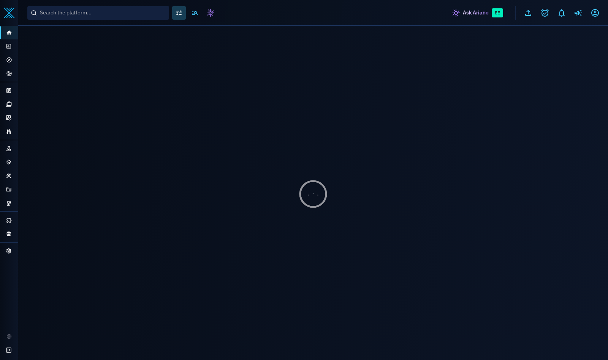
*تصویر ۱ — داشبورد اصلی پس از ورود؛ دکمهٔ بنفش ✦ کنار جست‌وجو (NLQ) و دکمهٔ «Ask Ariane» با برچسب EE در نوار بالا دیده می‌شوند.*

---

## ۲. Ask AI روی فیلدهای متنی

**کجاست؟** کنار **هر فیلد متنی، Markdown و HTML** در سراسر پلتفرم (توضیحات موجودیت‌ها، نام‌ها، محتوا و…) یک آیکون کوچک ✳ (لوگوی XTM One) نمایش داده می‌شود — در انتهای فیلدهای متنی ساده و در گوشهٔ بالای ویرایشگرهای Markdown/HTML.

**چه می‌کند؟** منویی با ۶ عمل متنی باز می‌کند:

| عمل | mutation پشت‌صحنه | کاربرد |
|---|---|---|
| Fix spelling & grammar | `aiFixSpelling` | اصلاح املای گزارش‌ها پیش از انتشار |
| Make it shorter | `aiMakeShorter` | خلاصه‌سازی خوانا برای تیترها |
| Make it longer | `aiMakeLonger` | بسط توضیح کوتاه یک اندیکاتور |
| Change tone | `aiChangeTone` | تبدیل لحن به Tactical / Operational / Strategic |
| Summarize | `aiSummarize` | خلاصهٔ یک متن طولانی |
| Explain | `aiExplain` | توضیح سادهٔ یک متن تخصصی برای تحلیلگر تازه‌کار |

پاسخ در دیالوگ «Ask AI» استریم می‌شود؛ با دکمهٔ **Accept** متن فیلد جایگزین می‌شود و **Retry** دوباره تولید می‌کند. حداقل ۱۰ کاراکتر متن لازم است.

### مثال کاربردی (تست زنده)
فرم ساخت Report را باز کردیم، در توضیحات نوشتیم: *«APT28 is a Russian state-sponsored cyber espionage group active since 2004…»* و روی ✳ توضیحات → **Explain** زدیم:

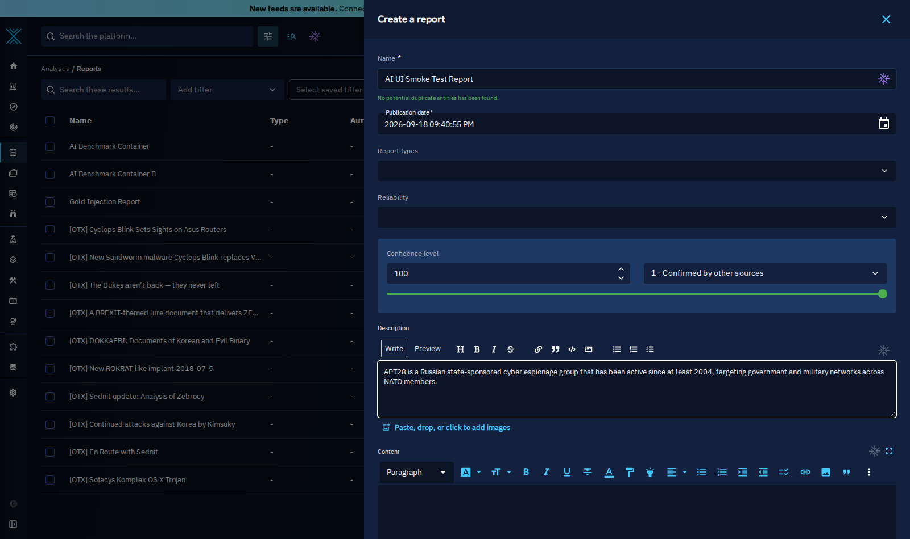
*تصویر ۲ — آیکون ✳ Ask AI روی فیلد Name (سمت راست فیلد) و روی ویرایشگر Description (بالای ویرایشگر).*

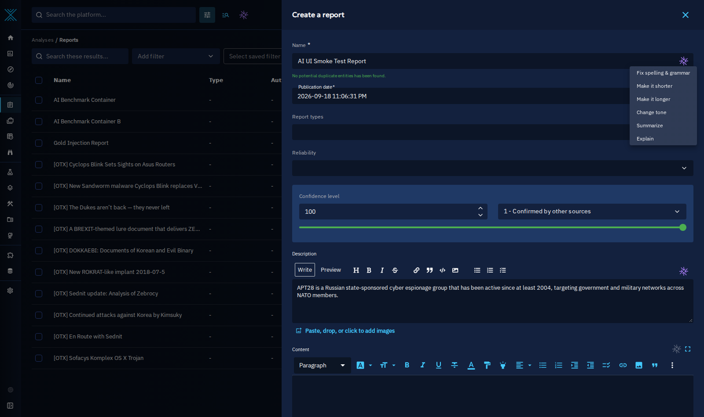
*تصویر ۳ — منوی ۶ عمله پس از کلیک روی آیکون.*

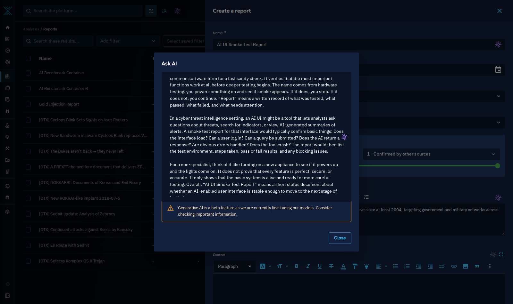
*تصویر ۴ — خروجی واقعی عمل «Explain»: مدل مفهوم «AI UI Smoke Test Report» را در سه پاراگراف ساده توضیح داده؛ بنر زرد هشدار Beta و دکمه‌های پذیرش پایین دیالوگ دیده می‌شود.*

**پشت‌صحنه:** درخواست GraphQL `aiExplain` با کد ۲۰۰ روی شبکه ثبت شد. متن اصلی و عمل انتخابی به سرور می‌رود، سرور آن را به مدل کانفیگ‌شده می‌دهد و پاسخ از طریق `aiBus` به دیالوگ استریم می‌شود.

---

## ۳. AI Insights

**کجاست؟** دکمهٔ **«AI Insights»** (با آیکون ✳) در هدر صفحهٔ Overview این موجودیت‌ها: Intrusion Set، Campaign، Threat Actor (گروه/فرد)، Malware، Event Incident، Sector، Country، Region — و روی Report/Grouping/Case‌ها با تب محدودتر «Containers».

**چه می‌کند؟** یک Drawer سمت راست با تا ۴ تب تحلیلی باز می‌کند:

| تب | محتوا | منبع داده |
|---|---|---|
| **Activity** | خلاصهٔ روند فعالیت اخیر موجودیت (اندیکاتورها، قربانیان، روابط) | آمار پلتفرم + LLM |
| **Containers digest** | خلاصهٔ ریپورت‌ها/کیس‌های مرتبط (با فیلتر) | کانتینرهای مرتبط + LLM |
| **Forecast** | پیش‌بینی روند آینده | روند تاریخی + LLM |
| **Internal history** | تاریخچهٔ داخلی پلتفرم (workbenches, notes…) | history داخلی + LLM |

هر تب به‌صورت خودکار کوئری می‌زند و پاسخ استریم‌شدهٔ مدل را با بنر «این خلاصه توسط AI تولید شده» نمایش می‌دهد. وقتی XTM One متصل باشد، یک Combobox «Select agent» بالای کشو اضافه می‌شود (اینجا چون XTM One نیست، مخفی است).

### مثال کاربردی (تست زنده)
صفحهٔ موجودیت **APT28** را باز کردیم → دکمهٔ AI Insights → تب Activity به‌طور خودکار خلاصهٔ زیر را تولید کرد:

> *«APT28 Activity Summary Based on OpenCTI Statistics — APT28, also tracked under aliases including IRON TWILIGHT, SNAKEMACKEREL, Swallowtail, Group 74, Sednit, Sofacy… The indicators of compromise series covers 25 monthly observation points…»*

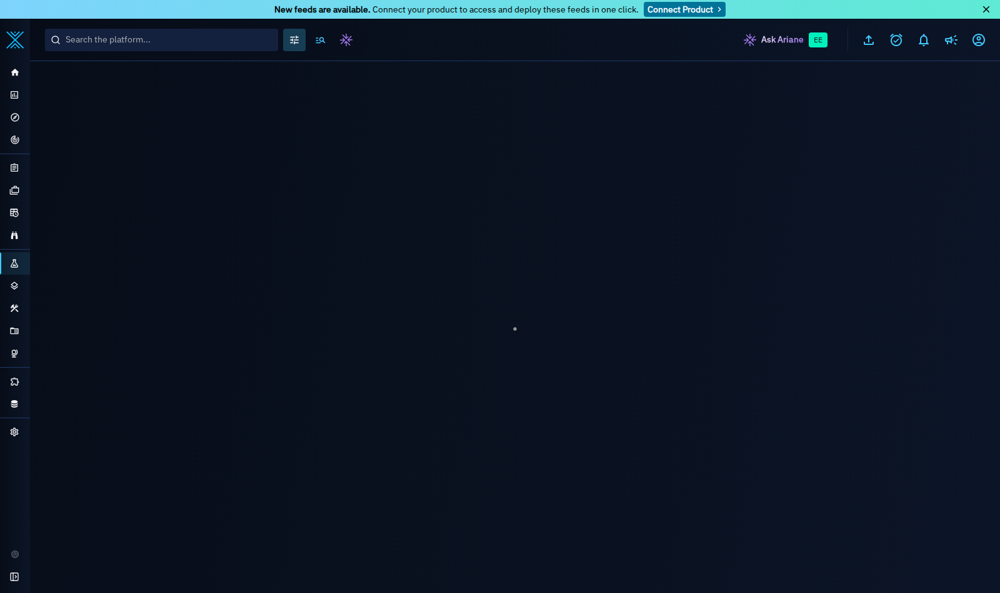
*تصویر ۵ — صفحهٔ Overview ی APT28؛ دکمهٔ AI Insights در ردیف بالای تب‌ها سمت چپ «Add Security coverage».*

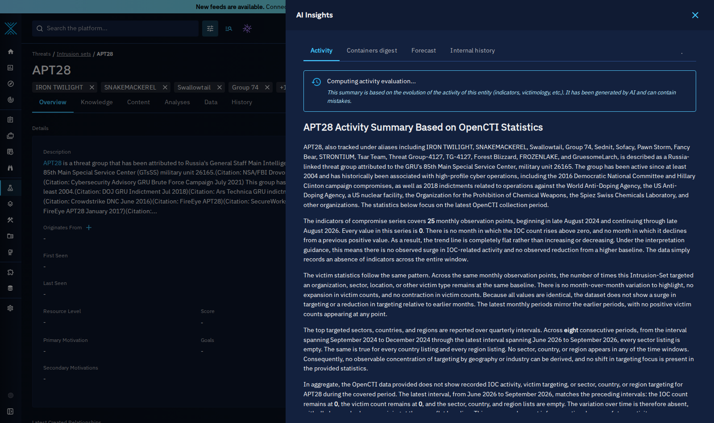
*تصویر ۶ — خروجی زندهٔ تب Activity: خلاصهٔ چندپاراگرافی مبتنی بر آمار واقعی پلتفرم (aliases های APT28، بازهٔ زمانی داده‌ها، تحلیل روند IOC). نوار «Computing activity evaluation…» بالای متن نشان‌دهندهٔ استریم است.*

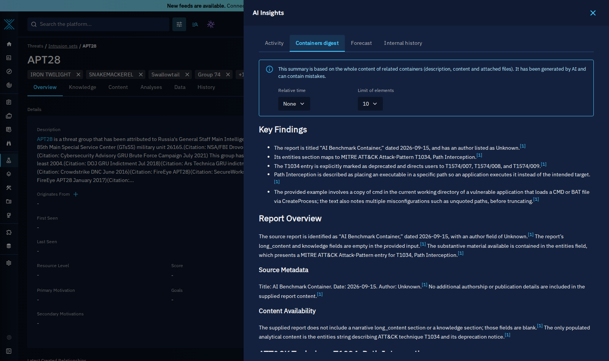
*تصویر ۷ — تب Containers digest: خلاصهٔ هوشمند ریپورت‌های مرتبط با موجودیت.*

**کاربرد عملی:** تحلیلگری که وارد صفحهٔ یک Threat Actor ناشناخته می‌شود، بدون خواندن ده‌ها ریپورت، در چند ثانیه تصویر کلی فعالیت اخیر، کانتینرهای مرتبط و روند آینده را می‌گیرد.

---

## ۴. ریپورت هوشمند کانتینرها

**کجاست؟** داخل صفحهٔ کانتینرها (Report، Case-Incident، Case-RFI، Grouping) → تب **Content** → ردیف «Description & Main content» → دکمهٔ ⋮ → گزینهٔ **Generate a PDF export**. دیالوگ باز می‌شود؛ از نوار مرحله‌ها (Stepper) روی **Format** کلیک کنید تا کارت **Ask AI** دیده شود.

> ⚠️ نکتهٔ مهم کشف‌شده در تست: دیالوگ Export موجود در تب **Data** (کارت Exported files) گزینهٔ AI **ندارد** — فهرست Format آن فقط فرمت‌های کانکتورهای export فعال است. مسیر رسمی AI از تب **Content** است: دو دیالوگ مجزا در کد وجود دارد و فقط دیالوگِ تب Content کارت Ask AI را رندر می‌کند.

**چه می‌کند؟** کل «گراف دانش» کانتینر (موجودیت‌ها + روابط داخل Report/Case) را به مدل می‌دهد و یک **ریپورت متنی کامل** می‌سازد. قبل از تولید، پارامترها را می‌پرسد:

- **Format:** HTML / Markdown / Plain text / JSON
- **Tone:** Tactical / Operational / Strategic
- **Number of paragraphs**
- **Language:** ده‌ها زبان

پس از تولید، دیالوگ **Select destination** مقصد را می‌پرسد: درج در **محتوای اصلی موجودیت** یا ساخت **فایل جدید** با نام دلخواه.

### مثال کاربردی (تست زنده)
یک Report آزمایشی ساختیم → تب Content → ⋮ → Generate a PDF export:

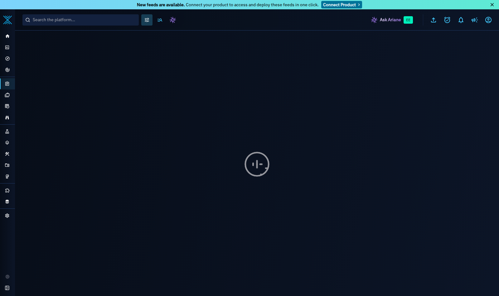
*تصویر ۸ — تب Content کانتینر؛ ردیف «Description & Main content» با دکمهٔ ⋮ (راهنمای «Generate a PDF export» نمایان است).*

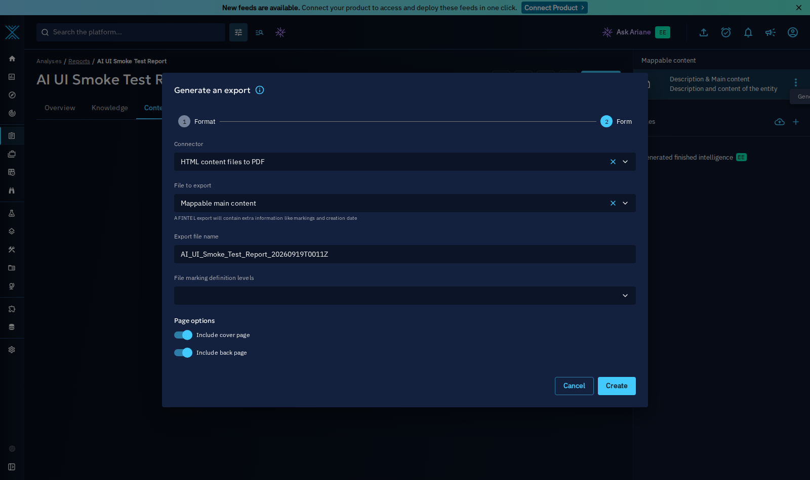
*تصویر ۹ — دیالوگ Export در مرحلهٔ Form (کانکتور PDF، فایل خروجی و گزینه‌های صفحه). با کلیک روی مرحلهٔ «1 Format» به شبکهٔ کارت‌ها شامل کارت Ask AI می‌رسیم.*

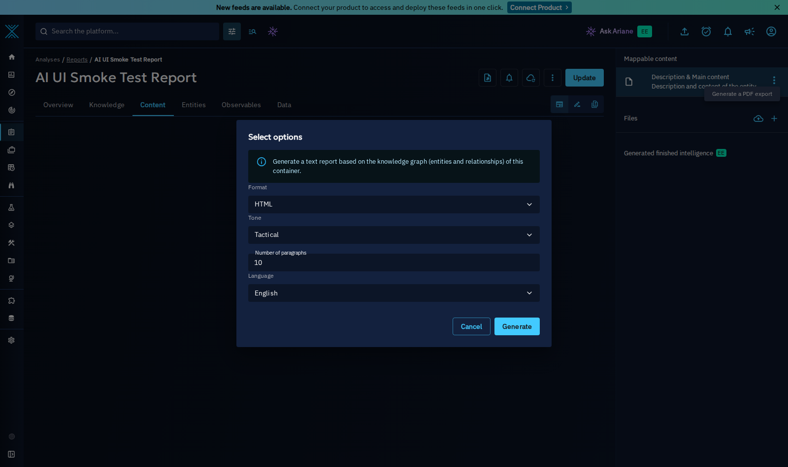
*تصویر ۱۰ — پس از انتخاب کارت Ask AI: پیام «Generate a text report based on the knowledge graph (entities and relationships) of this container» با انتخاب Format=HTML، Tone=Tactical، 10 پاراگراف، زبان English و دکمهٔ Generate.*

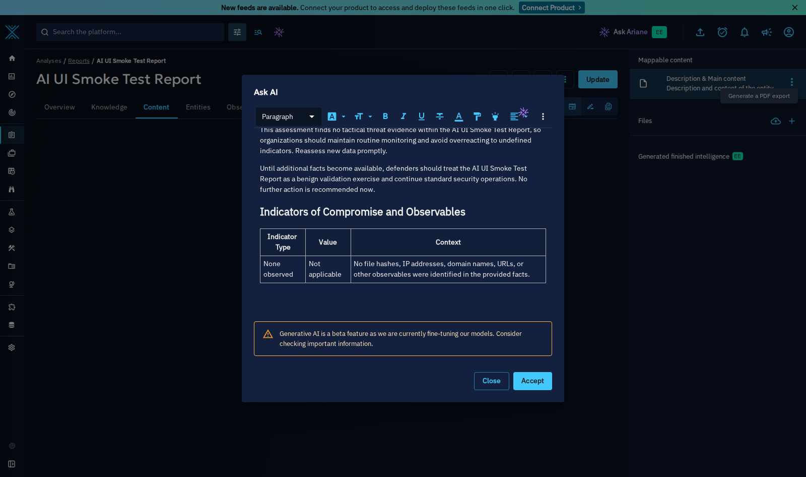
*تصویر ۱۱ — خروجی واقعی: ریپورت AI با بندهای تحلیلی و جدول «Indicators of Compromise and Observables». دکمه‌های Close/Accept پایین دیالوگ.*

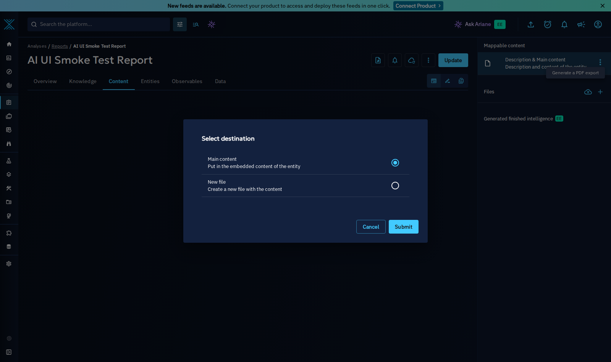
*تصویر ۱۲ — پس از Accept: انتخاب مقصد — درج در «Main content» یا ساخت «New file». با Submit محتوا ثبت می‌شود.*

**کاربرد عملی:** تحلیلگر یک Report با ۵۰ موجودیت و ۸۰ رابطه می‌سازد (یا از import می‌گیرد) و به‌جای نوشتن دستی خلاصهٔ اجرایی، با دو کلیک ریپورت اولیهٔ آمادهٔ ویرایش می‌گیرد.

---

## ۵. جست‌وجوی زبان طبیعی (NLQ)

**کجاست؟** دکمهٔ ✦ بنفش کنار فیلد جست‌وجوی نوار بالا. با کلیک، حالت جست‌وجو به NLQ می‌رود و placeholder به «Ask your question…» تغییر می‌کند.

**قرار است چه کند؟** سؤال فارسی/انگلیسی کاربر (مثلاً «all malware used by APT28») به **گروه فیلتر استاندارد OpenCTI** تبدیل می‌شود (mutation ‏`aiNLQ` با few-shot و تشخیص نام موجودیت‌ها) و مستقیم صفحهٔ نتایج فیلترشده باز می‌شود. اگر موجودیتی که کاربر نام برده پیدا نشود، toast هشدار می‌دهد.

### مثال کاربردی (تست زنده) و یک یافتهٔ مهم

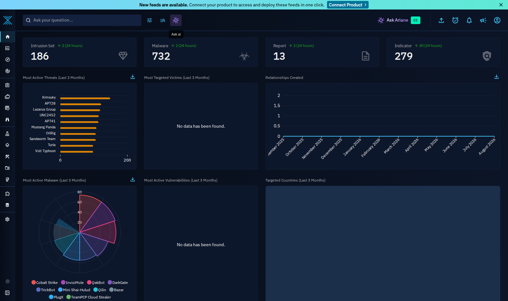
*تصویر ۱۳ — حالت NLQ فعال: placeholder به «Ask your question…» تغییر کرده و دکمهٔ ✦ بنفش/فعال است (tooltip: Ask ai).*

سؤال «malware used by APT28» را فرستادیم؛ صفحهٔ نتایج باز شد، اما بررسی شبکه (wire) نشان داد **mutation ‏`aiNLQ` اصلاً ارسال نشده** و جست‌وجو به‌صورت کلیدواژه‌ای انجام شده است:

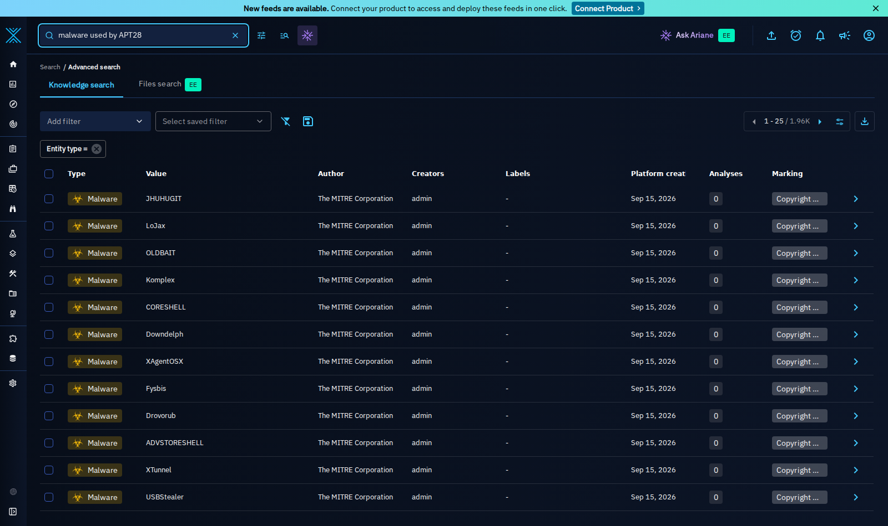
*تصویر ۱۴ — صفحهٔ نتایج؛ چیپ «Entity type=» خالی، فیلتر پیش‌فرض خود صفحهٔ جست‌وجوست (در آزمون کنترل‌شده، جست‌وجوی معمولی هم دقیقاً همین URL را ساخت).*

**علت (کشف فنی):** شرط `askAI && isEnterpriseEdition` در `TopBar.tsx:194`. لایسنس EE در این استقرار منقضی است، پس درخواست NLQ بی‌صدا به جست‌وجوی کلیدواژه‌ای می‌افتد. خودِ بک‌اند (`aiNLQ`) قفل EE ندارد و در بنچمارک، فیلترهای درست تولید می‌کند؛ **رفع آن فقط حذف همین یک شرط در TopBar است.** این دقیقاً نمونه‌ای از دستهٔ «دکمه هست، عملاً کاری نمی‌کند» است.

---

## ۶. پنل ایجنت محلی

**کجاست؟** مسیر **`/dashboard/agent`** (در منوی کنار صفحه). این قابلیتِ افزوده‌شدهٔ همین checkout است و به ایجنت اختصاصی ما وصل می‌شود — نه به XTM One و نه به مدل legacy.

**معماری:** مرورگر → `POST /ai-agent/ask` (همان‌origin) → پروکسی بک‌اند (`httpAgentProxy.ts`؛ احراز هویت کاربر + تایم‌اوت ۳ دقیقه) → opencti-agent روی `:8100` (FastAPI، pydantic-ai) → ایجنت با ۱۰ ابزار **فقط‌خواندنی** GraphQL (جست‌وجو، دریافت موجودیت، batch، find_paths، عملیات مجموعه‌ای و…) به خود پلتفرم کوئری می‌زند → پاسخ Markdown + لیست **Cited entities**.

### مثال کاربردی (تست زنده)

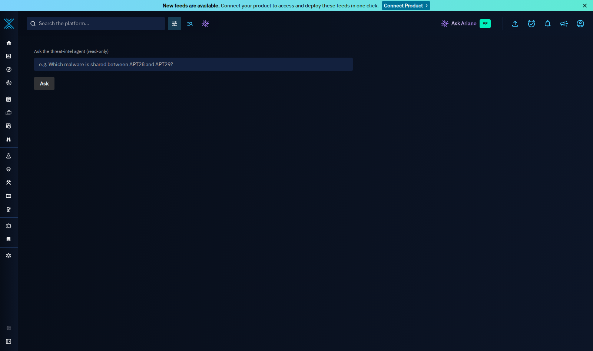
*تصویر ۱۵ — صفحهٔ ایجنت: ورودی «Ask the threat-intel agent (read-only)» و دکمهٔ Ask.*

سؤال: **«Which malware is shared between APT28 and APT29?»**

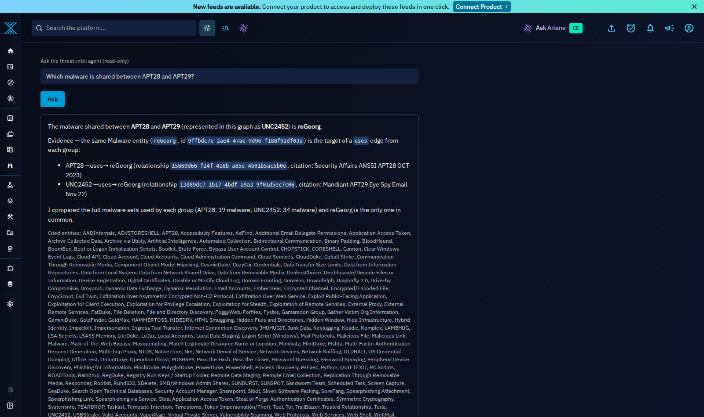
*تصویر ۱۶ — پاسخ واقعی ایجنت: «The malware shared between APT28 and APT29 (represented in this graph as UNC2452) is **reGeorg**» به‌همراه **شواهد** (هر دو یال uses با شناسهٔ رابطه و منبع/citation) و لیست کامل «Cited entities». HTTP 200 از `/ai-agent/ask` ثبت شد.*

**کاربرد عملی:** پرسش‌های تحلیلی چندمرحله‌ای (اشتراک malware بین دو گروه، مسیر ارتباطی بین دو موجودیت، مجموعه‌ها) که با جست‌وجوی ساده نمی‌شود — ایجنت خودش چند ابزار را زنجیر می‌زند و جواب مستند با citation می‌دهد.

---

## ۷. Ask Ariane و CTEM Command Center

**کجاست؟** هر دو در نوار بالا، سمت راست: دکمهٔ «Ask Ariane» (با برچسب EE) و آیکون رادار CTEM.

**این‌ها مقصدشان XTM One است** (چت‌بات agentic ابری فیلیگران با تاریخچهٔ مکالمه، آپلود فایل و تأیید انسانی فراخوانی ابزار) و **به ایجنت محلی ما وصل نیستند.**

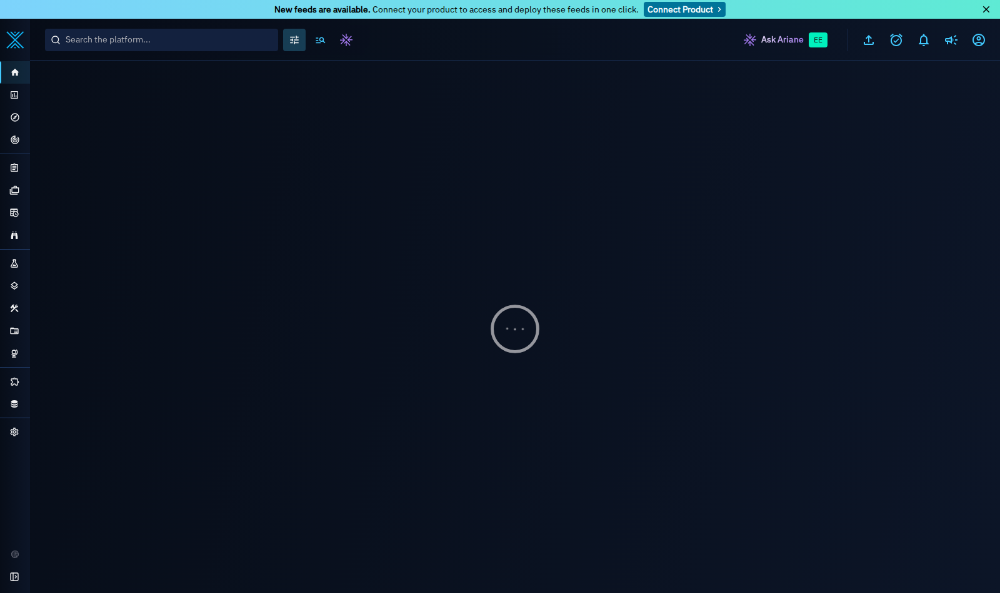
*تصویر ۱۷ — دکمهٔ Ask Ariane در نوار بالا با برچسب سبز EE (نشان می‌دهد فعال نیست).*

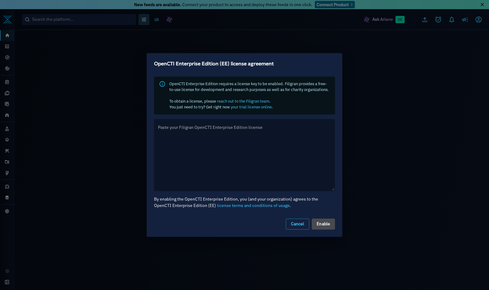
*تصویر ۱۸ — نتیجهٔ واقعی کلیک با اکانت ادمین در وضعیت فعلی: فقط دیالوگ «Enterprice Edition license agreement» باز می‌شود؛ چت هرگز باز نمی‌شود.*

**شرط لازم برای فعال شدن هر سه مورد:** ① لایسنس EE معتبر، ② پذیرش Filigran AI Terms (CGU=enabled در Settings→Experience)، ③ اتصال XTM One (`xtm_one_configured=true`). بدون این سه، این دکمه «هست ولی کار نمی‌کند» — و آیکون CTEM اصلاً رندر نمی‌شود.

---

## ۸. تنظیمات AI

**کجاست؟** **Settings → Filigran Experience**. این صفحه سه بخش مرتبط دارد:

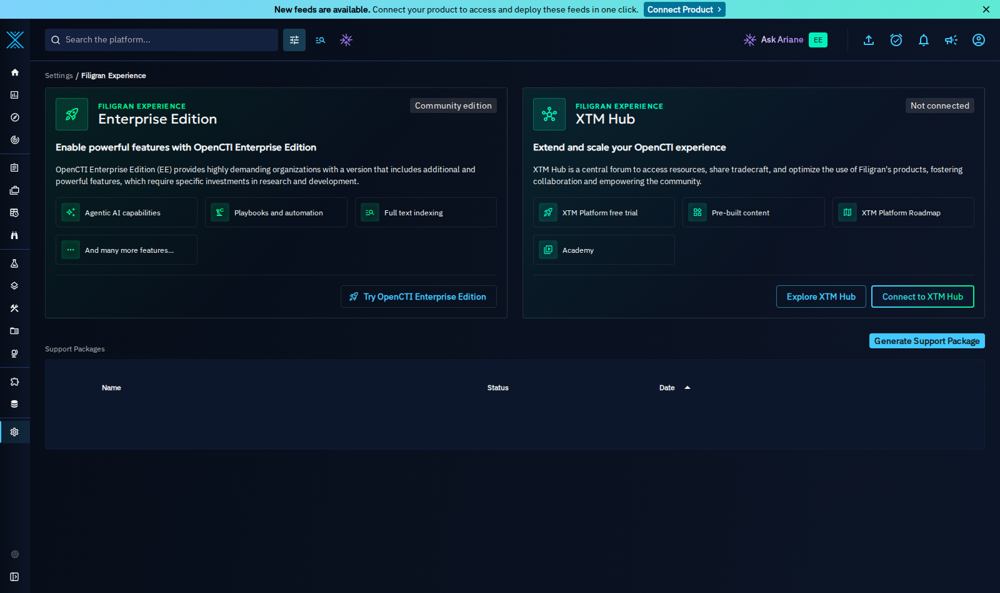
*تصویر ۱۹ — Settings → Filigran Experience در حالت Community: کارت Enterprise Edition (با قید «Agentic AI capabilities»)، کارت XTM Hub (Not connected) و بخش Support Packages.*

- وقتی EE فعال باشد، در کارت Enterprise ردیف **«XTM One (Agentic AI)»** ظاهر می‌شود: اگر CGU در حالت pending باشد دکمهٔ **Validate the Filigran AI Terms** و در غیر این صورت یک **سوییچ** خاموش/روشن.
- وقتی XTM One متصل نباشد ردیف **«Generative AI (AI Insight, NLQ)»** نمایش داده می‌شود: سوییچ `platform_ai_enabled` که همهٔ دکمه‌های ✳ Ask AI و AI Insights را خاموش/روشن می‌کند.
- دیالوگ **ValidateTermsOfUseDialog** (پذیرش/رد قوانین Filigran AI) هم از همین‌جا و هم از دکمه‌های Ask AI/AI Insights در حالت pending باز می‌شود.
- مدل legacy در فایل `opencti-graphql/config/development.json` تنظیم می‌شود (endpoint سازگار OpenAI + token + model + max_tokens).

---

## ۹. معماری مسیریابی

تصمیم «این دکمه به کجا می‌رود؟» در فرانت با دو قلاب گرفته می‌شود:

```
useAI()                 → { enabled, configured, fullyActive }
useChatbot().xtmOneConfigured → از GET /chatbot/config
```

- اگر `xtmOneConfigured === true` باشد → مسیر **XTM One agent** (intentهای cti.*، انتخابگر ایجنت، چت Ariane).
- در غیر این صورت → مسیر **legacy** (mutationهای GraphQL داخلی + استریم `aiBus` با مدل کانفیگ‌شده).
- استثنا: صفحهٔ `/dashboard/agent` که همیشه و فقط به **opencti-agent** (`/ai-agent/ask`) می‌رود.

نتیجهٔ عملی در این checkout (بدون XTM One): Ask AI، AI Insights و ریپورت کانتینر **همه با موفقیت روی مدل legacy کار می‌کنند** (تست شد)، در حالی که چت‌بات/CTEM/بلوک‌های Playbook و انتخابگرهای ایجنت به‌دلیل وابستگی به XTM One غیرفعال‌اند.

---

## ۱۰. قابلیت‌های بدون جایگزین

این‌ها فقط با XTM One کار می‌کنند و در این استقرار «دکمه/قابلیت سر جایش نیست یا عملاً کاری نمی‌کند»:

| قابلیت | وضعیت اینجا | شرط فعال شدن |
|---|---|---|
| چت Ask Ariane | دکمه نمایان، کلیک → فقط دیالوگ لایسنس EE | EE + CGU + XTM One |
| آیکون CTEM Command Center | رندر نمی‌شود | XTM One |
| بلوک‌های Playbook: «Transform with AI agent» / «Send to AI agent» | از فهرست بلوک‌ها حذف می‌شوند (`availableComponents` + گیت EE) | EE + XTM One token |
| انتخابگر ایجنت در Import (کانکتورهای دارای `xtm_one_intent`) | غیب — چنین کانکتوری تعریف نشده | XTM One + ایجنت bind شده |
| Combobox «Select agent» در AI Insights و فلش ایجنت NLQ | مخفی/خالی | XTM One |
| کارت XTM One MCP در Profile | حالت «متصل نیست» | XTM One |

---

## ۱۱. APIهای بدون UI

در اسکیمای GraphQL (`ai.graphql`) این mutationها وجود دارند ولی در این نسخه دکمه‌ای در UI ندارند (قابل استفاده از API/automation):

| mutation | کار |
|---|---|
| `aiThreatGenerateReport` / `aiVictimGenerateReport` | ریپورت‌سازی برای Threat Actor ها و قربانیان (مثل ریپورت کانتینر) |
| `aiConvertIndicator` | تبدیل اندیکاتور بین STIX / Sigma / YARA |
| `aiImproveWriting` | بهبود نگارش متن |
| `aiSummarizeFiles` / `aiConvertFilesToStix` | خلاصه‌سازی فایل‌ها و تبدیل فایل به STIX (**منسوخ**) |

---

## ۱۲. پیوست

**محیط تست:** OpenCTI روی `:4000` (backend)، vite dev روی `:3001`، opencti-agent روی `:8100`؛ کاربر ادمین؛ شاخهٔ `ai-ungate`.

**روش:** اسکریپت‌های Playwright (`/tmp/opencode/ai-ui/`) لاگین، پیمایش و کلیک‌ها را انجام دادند؛ درخواست‌های GraphQL/HTTP رهگیری شدند تا «کار کردن» فقط با ظاهر اثبات نشود — هر قابلیت با کد وضعیت شبکه هم تأیید شد (مثلاً `aiExplain: 200`، `aiContainerGenerateReport: 200`، `/ai-agent/ask: 200`).

**بازتولید:** `cd /tmp/opencode/ai-ui && node flow4.mjs` (ریپورت کانتینر) — سایر اسکریپت‌ها: `shoot.mjs` تا `shoot8b.mjs`.

**دو اصلاح پیشنهادی ناشی از این تست:**
1. `TopBar.tsx:194` — حذف `isEnterpriseEdition` از شرط NLQ تا مثل بقیهٔ قابلیت‌ها روی این شاخه ungated شود (یکی‌خطی).
2. در صورت تمایل، مسیر legacy چت‌بات (Ask Ariane) به opencti-agent محلی (`:8100`) سیم‌کشی شود تا چت هم بدون XTM One کار کند.
